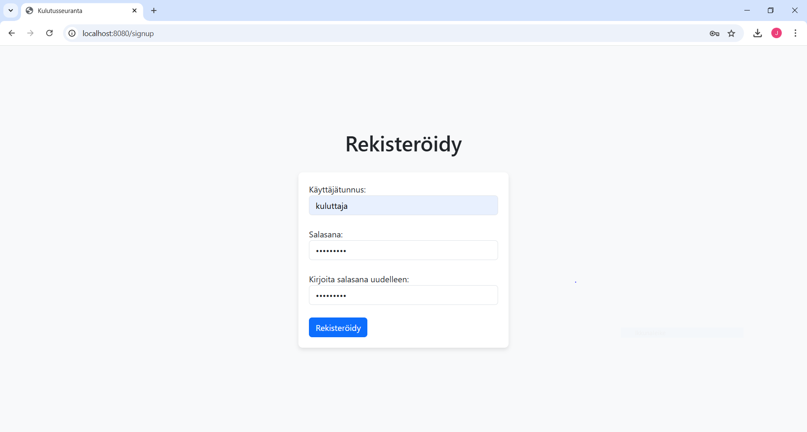
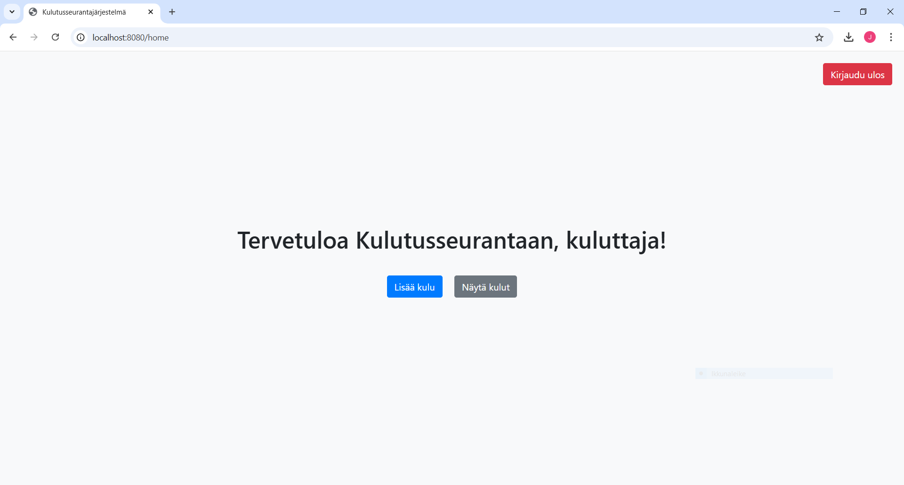
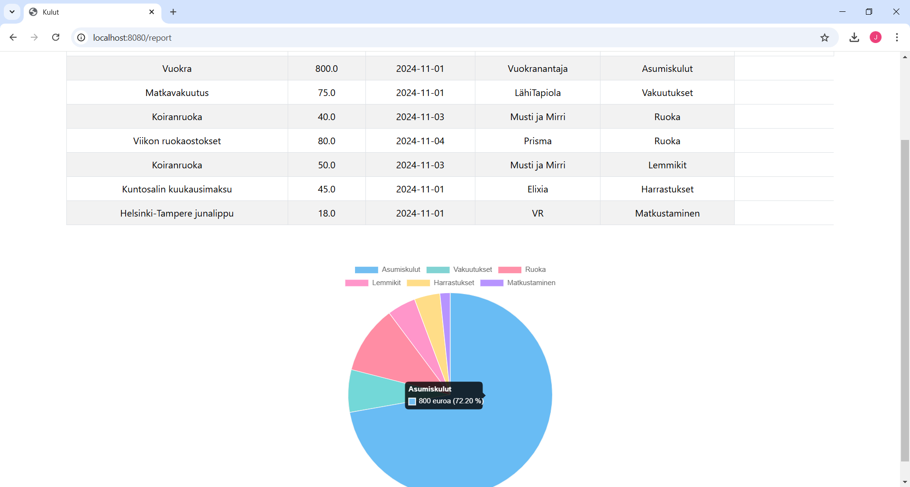
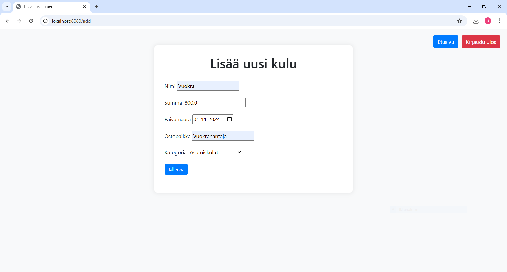
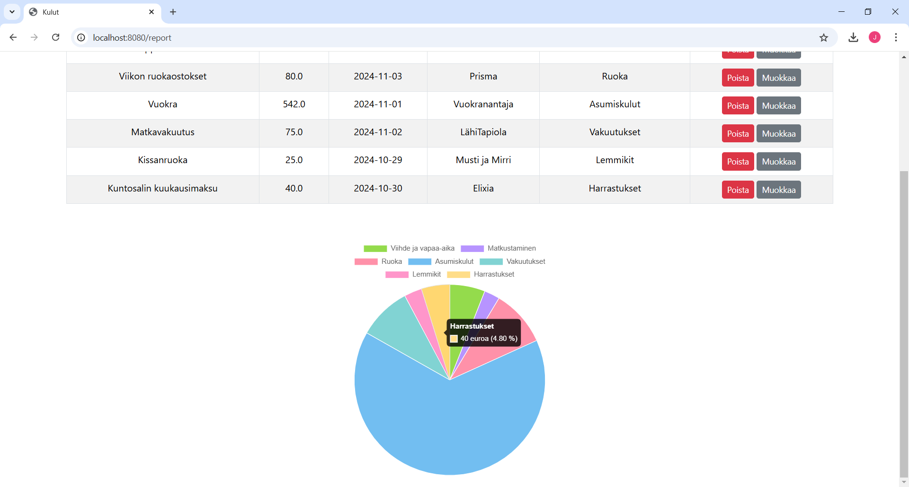
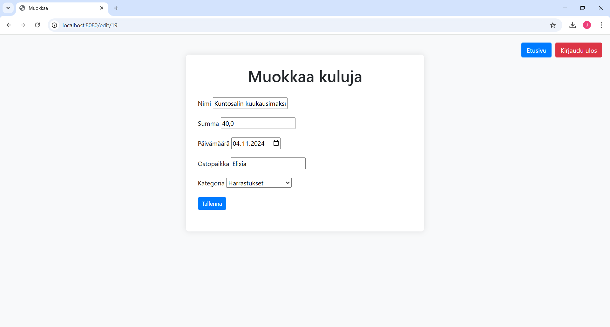

# Kulutusseuranta

Tämä ohjelmointiprojekti on toteutettu Backend ohjelmointi-kurssin lopputyönä Haaga-Helia ammattikorkeakoulussa. Työn aiheena on kulutusseurantajärjestelmä, jossa käyttäjä
voi tarkastella omaa kulutustaan ja kulujen jakautumista eri kategorioihin.

## Toiminnallisuudet
- Käyttäjien hallinta ja todennus: rekisteröinti- ja kirjautumissivu.
- Peruskäyttäjä voi lisätä kuluja ja nähdä lisäämänsä kulut.
- Admin-käyttäjä voi lisätä, poistaa ja muokata kuluja sekä nähdä lisäämänsä kulut (CRUD).
- Käyttäjän tiedot tallennetaan ulkoiseen tietokantaan (PostgreSQL).
- Kulut on esitetty sekä taulukossa että ympyrädiagrammissa, josta käyttäjä voi tarkastella kulujen
  jakautumista kategorioittain.
- Jokainen käyttäjä voi nähdä vain omat tietonsa.

## Käytetyt teknologiat
- Spring Boot
- PostgreSQL
- Java
- HTML
- Thymeleaf

## Kuvia

